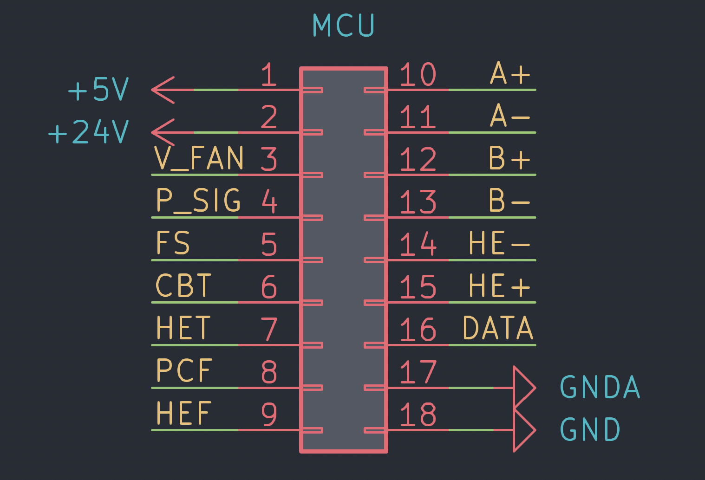

# StealthBurner-PCB
为 Voron Design 最新的 StealthBurner 设计的集线 PCB 板

在线 BOM 表：http://blog.charlie.moe/StealthBurner-toolhead-pcb/bom/bom

## 特点
+ 自带一个 NTC 3950 10K 的热敏电阻，可以用于测试仓温
+ 使用 StealthBurner 官方的固定孔位，可以无损兼容现有打印件
+ 使用 18 根线，比直连更省线材

## 使用

### 打样
使用「gerber」文件夹内的文件即可，建议使用 1mm 板厚，10mil 最小线宽

### 接线

1. 将 5v 连接到 LED 的 5v 电源，将 DATA 连接到 LED 信号引脚
2. 将 V_FAN 连接到你使用的风扇电源正极（两个风扇只能使用同一电压），将 PCF 和 HEF 连接到对应风扇负极
3. 将 +24v 连接到探头电源，将 P_SIG 连接到探头信号引脚
4. 将 GNDA 连接到测温接口的负极，将 CBT 和 HET 连接到对应侧温接口的正极（两个热敏电阻共地）
5. 将 A+/A-/B+/B- 连接到步进电机驱动
6. 将 HE+/HE- 连接到热端加热器接口
